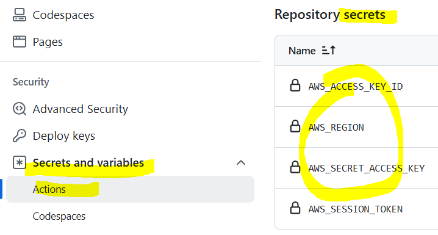

# 🔐 Guía de Seguridad para Configuración de Base de Datos

## Crear entorno virtual

    python3 -m venv v_env_flask_chatgpt
    source v_env_flask_chatgpt/bin/activate


## Secretos en Github Actions y AWS Secrets Manager

### Github Actions Secrets
- **Uso:** Almacenar credenciales y configuraciones sensibles
- **Acceso:** Solo disponible en el contexto del repositorio
- **Necesitamos:** `AWS_ACCESS_KEY_ID`, `AWS_SECRET_ACCESS_KEY`, 'AWS_SESSION_TOKEN', `AWS_REGION`, `ECR_REPOSITORY`, `ECS_CLUSTER`


*Configuración de secretos necesarios en GitHub Actions para el deployment en AWS*


### AWS Secrets Manager
- **Uso:** Almacenar y gestionar secretos de forma segura
- **Acceso:** Integración con servicios de AWS (ECS, Lambda, etc.)
- **Ejemplo:** Credenciales de base de datos, API keys

## 📋 Instrucciones de Instalación Segura

### 1️⃣ Configurar Variables de Entorno


1. **Copia el archivo de ejemplo:**
   ```bash
   cp .env.example .env
   ```

2. **Edita el archivo `.env` con tus credenciales reales:**
   ```bash
   # NO compartas este archivo - está en .gitignore
   DB_HOST=tu_host_mysql
   DB_USER=tu_usuario
   DB_PASSWORD=tu_password_seguro
   DB_NAME=AlumnosClases
   ```

### 2️⃣ Instalar Dependencias

```bash
pip install -r requirements.txt
```

### 3️⃣ Ejecutar la Aplicación

```bash
python app.py
```

## 🛡️ Mejoras de Seguridad Implementadas

### ✅ Variables de Entorno
- **Antes:** Credenciales hardcodeadas en el código
- **Ahora:** Variables de entorno seguras en archivo `.env`
- **Beneficio:** Las credenciales no se suben al repositorio

### ✅ Archivo .gitignore
- **Protege:** Archivo `.env` nunca se sube a Git
- **Incluye:** Logs, archivos temporales, base de datos local
- **Resultado:** Información sensible protegida

### ✅ Configuración por Defecto Segura
- **Fallbacks:** Valores por defecto seguros si falta `.env`
- **Debug Mode:** Deshabilitado por defecto en producción

### ✅ Documentación
- **`.env.example`:** Plantilla para otros desarrolladores
- **Instrucciones:** Guía paso a paso para configuración
- **Mejores prácticas:** Documentación de seguridad

## 🚨 Recomendaciones de Seguridad Adicionales

### 🌐 Variables de Entorno en Producción
- **Docker:** Usar secrets o variables de entorno
- **Cloud:** Usar servicios como AWS Secrets Manager
- **Servidor:** Configurar variables de sistema

### 🔒 Credenciales de Base de Datos
- **Usuario específico:** No usar root en producción
- **Permisos mínimos:** Solo los permisos necesarios
- **Conexión SSL:** Habilitar conexiones encriptadas

## ⚠️ NUNCA Hagas Esto

❌ **NO** subas archivos `.env` al repositorio  
❌ **NO** hardcodees credenciales en el código  
❌ **NO** uses credenciales de desarrollo en producción  
❌ **NO** compartas credenciales por email/chat  

## 🎯 Buenas Prácticas

✅ **SÍ** usa diferentes credenciales por entorno  
✅ **SÍ** rota las credenciales regularmente  
✅ **SÍ** usa conexiones SSL en producción  
✅ **SÍ** monitorea accesos a la base de datos  

---
*🔐 La seguridad es responsabilidad de todos. Mantén las credenciales seguras.*


## TODO AWS CloudWatch Logs. IMPORTANTE
- **Uso:** Monitoreo y almacenamiento de logs de la aplicación
- **Configuración:** Asegúrate de que el rol de ejecución de la tarea ECS tenga permisos para escribir en CloudWatch Logs
- **Beneficio:** Facilita la auditoría y solución de problemas sin exponer información sensible
- Hay que crear un grupo de registros en CloudWatch llamado `/ecs/flask-app` para que los logs se almacenen correctamente.

## TODO Crear un cluster ECS
- En la consola de AWS, navega a ECS > Clusters > Create Cluster
- Selecciona "Networking only" (Fargate)
- Asigna un nombre al cluster, por ejemplo, `flask-app-cluster`
- Deja las demás configuraciones por defecto y crea el cluster

## TODO implementar la tarea. Asignar la tarea al cluster ECS

- Esto se tendrá que hacer en el workflow de GitHub Actions, en el paso de deploy.

## TODO AWS VPC y grupo de seguridad

- Abrir el puerto 80 en el grupo de seguridad asociado a la instancia ECS para permitir el tráfico HTTP entrante.

