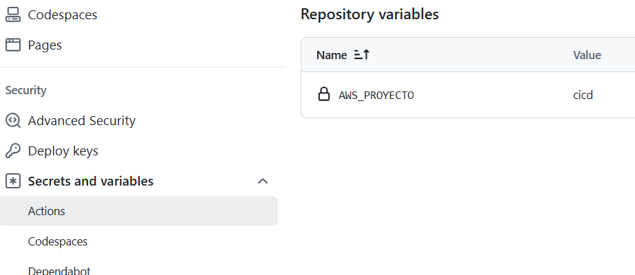

# 🚀 Despliegue Automático de Flask en AWS ECS con GitHub Actions en AWS Academy.

Este proyecto implementa una arquitectura moderna para desplegar una aplicación Flask en AWS ECS Fargate, usando integración continua y despliegue continuo (CI/CD) con GitHub Actions, AWS ECR, Secrets Manager y CloudFormation.

---

## 🏗️ Arquitectura General

```text
GitHub Actions ──► ECR (Docker Image)
             │
             └──► ECS Fargate (Task/Service)
                            │
                            └──► Application Load Balancer
                                                 │
                                                 └──► Internet
```

- **Código fuente**: Python (Flask)
- **Infraestructura**: CloudFormation (VPC, subredes, ECS, ALB, ECR, IAM, etc.)
- **Contenedores**: Docker
- **Secrets**: AWS Secrets Manager
- **CI/CD**: GitHub Actions

---

## ⚙️ ¿Qué hace este proyecto?

- Despliega automáticamente una app Flask en AWS ECS Fargate usando GitHub Actions.
- Construye y sube la imagen Docker a ECR.
- Usa un workflow YAML que reemplaza variables dinámicamente (nombres de recursos, ARNs, etc.).
- Inyecta secretos de base de datos desde AWS Secrets Manager al contenedor de Flask.
- Expone la app a través de un Application Load Balancer.
- Toda la infraestructura se define como código (IaC) en CloudFormation.

---

## 📂 Estructura del Repositorio

```text
├── app.py                  # Código principal Flask
├── requirements.txt        # Dependencias Python
├── Dockerfile              # Imagen Docker para Flask
├── ecs-task-def.json       # Definición de tarea ECS (plantilla)
├── cloudformation/         # Plantillas CloudFormation (VPC, ECS, ALB, etc.)
├── .github/workflows/aws.yml # Workflow CI/CD principal
├── static/, templates/     # Archivos web Flask
├── AWS_SECRETS_SETUP.md    # Guía avanzada de secretos y seguridad
└── ...
```

---

## 🔑 Variables y Secrets necesarios en el repositorio de GITHUB

| Nombre                | Tipo    | Descripción                                      |
|-----------------------|---------|--------------------------------------------------|
| AWS_ACCESS_KEY_ID     | Secret  | Access key de AWS para autenticación              |
| AWS_SECRET_ACCESS_KEY | Secret  | Secret key de AWS para autenticación              |
| AWS_SESSION_TOKEN     | Secret  | Token temporal de sesión (si aplica)              |
| AWS_REGION            | Secret/Var | Región AWS donde se despliega la infraestructura |
| AWS_PROYECTO          | Var     | Nombre base para recursos (ECR, ECS, etc.)        |




Importante. En AWS Academy los ID, KEY y token de sesión (`AWS_ACCESS_KEY_ID`, `AWS_SECRET_ACCESS_KEY` y `AWS_SESSION_TOKEN`) cambian cada vez que se inicia el laboratorio. Así que debes actualizar estos secretos para evitar fallos en el workflow

---

## 🛠️ Flujo de Despliegue (CI/CD)

1. **Push a main**: El workflow se activa con cada push o pull request a la rama main.
2. **Build & Push**: Se construye la imagen Docker y se sube a ECR usando el nombre `${{ vars.AWS_PROYECTO }}-repo`.
3. **Secrets**: El workflow obtiene el ARN del secreto de base de datos (`secretos-despliegue-aws`) y lo inyecta en la definición de tarea ECS.
4. **Task Definition**: Se renderiza el archivo `ecs-task-def.json` con los valores reales (ARNs, nombres, etc.).
5. **Deploy**:
   - Crea:
      - Una nueva imagen docker con el código modificado.
      - Una nueva versión de la tarea existente.
   - Actualiza:
      - El servicio ECS (`${{ vars.AWS_PROYECTO }}-service`).
      - El cluster (`${{ vars.AWS_PROYECTO }}-cluster`).
   - Crea nuevos contenedores con la nueva imagen y los secretos inyectados.
6. **ALB**: El Application Load Balancer expone la app Flask a Internet.

---

## 🔒 Seguridad y buenas prácticas

- **Secrets centralizados** en AWS Secrets Manager (no en el código ni en variables de entorno locales).
- **Roles IAM mínimos** para ejecución de tareas y acceso a secretos/logs.
- **Logs** enviados a CloudWatch Logs para auditoría y troubleshooting.
- **Variables y nombres de recursos** gestionados dinámicamente por variables de entorno y GitHub Actions.
- **Infraestructura reproducible** y versionada con CloudFormation.

---

## 📋 Comandos útiles

### Crear el secreto de base de datos en AWS Secrets Manager

```bash
aws secretsmanager create-secret \
   --name secretos-despliegue-aws \
   --description "Database credentials for Flask app" \
   --secret-string '{
      "DB_HOST": "tu-rds-endpoint.amazonaws.com",
      "DB_USER": "tu_usuario",
      "DB_PASSWORD": "tu_password",
      "DB_NAME": "AlumnosClases"
   }'
```

### Verificar el secreto

```bash
aws secretsmanager get-secret-value \
   --secret-id secretos-despliegue-aws \
   --query SecretString --output text | jq .
```

### Desplegar infraestructura con CloudFormation

```bash
aws cloudformation deploy \
   --template-file cloudformation/CreaEntornoECS_FargateBasico.yaml \
   --stack-name flask-app-stack \
   --capabilities CAPABILITY_NAMED_IAM
```

---

## 📝 Recursos y documentación

- [AWS ECS Fargate](https://docs.aws.amazon.com/es_es/AmazonECS/latest/developerguide/what-is-fargate.html)
- [AWS Secrets Manager](https://docs.aws.amazon.com/secretsmanager/latest/userguide/intro.html)
- [GitHub Actions](https://docs.github.com/en/actions)
- [CloudFormation](https://docs.aws.amazon.com/AWSCloudFormation/latest/UserGuide/Welcome.html)

---

## ⚠️ Notas y advertencias

- El ARN del secreto incluye un sufijo aleatorio (ej: `-AbCdEf`). El workflow lo detecta automáticamente.
- No subas archivos `.env` ni credenciales al repositorio.
- El acceso a la app Flask es público a través del ALB (puerto 80). Configura HTTPS y reglas de seguridad según tu caso.
- Revisa y ajusta los permisos IAM y las políticas de seguridad según tus necesidades.

---

*Desarrollado para despliegues seguros y automáticos en AWS.*
